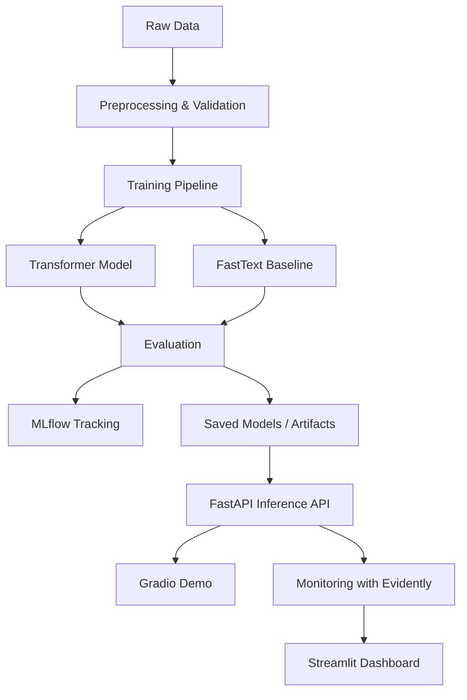
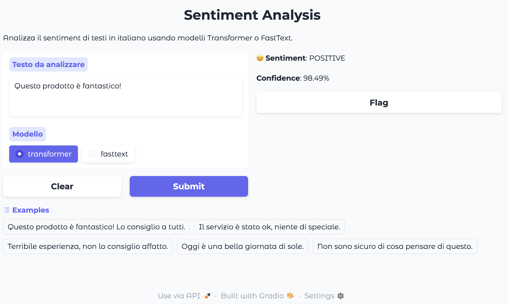

# Sentiment Analysis MLOps Pipeline

End-to-end **MLOps pipeline for sentiment analysis** combining modern NLP models, experiment tracking, API serving, and monitoring components.

The project demonstrates how a machine learning system can be structured using **engineering and MLOps principles**, including reproducible training, model comparison, deployment, and monitoring.

---

# Overview

This project implements a sentiment analysis system capable of classifying text into:

- **Positive**
- **Neutral**
- **Negative**

Two model approaches are included:

- **Transformer model** (primary model)  
  `cardiffnlp/twitter-roberta-base-sentiment-latest`

- **FastText model** (baseline trained in the project)

The goal is to demonstrate a complete **machine learning lifecycle**, from training to deployment and monitoring.

---

# ML Pipeline

The system follows a typical MLOps workflow:

```
Data Ingestion
      ↓
Data Processing
      ↓
Training (Transformer / FastText)
      ↓
Evaluation
      ↓
Experiment Tracking (MLflow)
      ↓
Model Serving (FastAPI)
      ↓
Monitoring (Evidently)
```

---



This pipeline highlights the end-to-end lifecycle of the project, from data processing and model training to API serving and monitoring.

# Architecture

The system includes several components:

**Data Pipeline**
- data ingestion
- preprocessing
- validation
- reproducible dataset splits

**Model Training**
- Transformer model for high accuracy
- FastText baseline for comparison

**Experiment Tracking**
- MLflow integration for experiment logging

**Model Serving**
- FastAPI inference API

**Deployment**
- Docker containerization
- docker-compose local deployment

**Monitoring**
- Evidently AI reports
- Streamlit monitoring dashboard

**CI/CD**
- GitHub Actions automated testing pipeline

---

# Demo Applications

## Sentiment Analysis Demo

A simple web interface allows interactive testing of the models.

Run locally:

```bash
python app.py
```

The interface will be available at:

```
http://127.0.0.1:7860
```

---

## Demo Interface

Interactive sentiment analysis demo built with Gradio.



The interface allows users to:

- input custom text
- select the model (Transformer or FastText)
- run real-time sentiment predictions
- test predefined example sentences

---

## Monitoring Dashboard

Monitoring reports can be visualized through a Streamlit dashboard.

```bash
streamlit run src/monitoring/dashboard.py
```

The dashboard shows:

- data quality metrics
- data drift
- prediction drift
- model performance

---

# Quick Start

Clone the repository:

```bash
git clone https://github.com/Nimus74/sentiment-analysis-mlops.git
cd sentiment-analysis-mlops
```

Create a virtual environment:

```bash
python -m venv venv
source venv/bin/activate
```

Install dependencies:

```bash
pip install -r requirements.txt
pip install -e .
```

---

# Training Models

Train the Transformer model:

```bash
python src/training/train_transformer.py --config configs/config.yaml
```

Train the FastText baseline:

```bash
python src/training/train_fasttext.py --config configs/config.yaml
```

---

# Run the API

Using Docker:

```bash
docker-compose up
```

Or run directly:

```bash
uvicorn src.api.main:app --host 0.0.0.0 --port 8000
```

Example request:

```python
import requests

response = requests.post(
    "http://localhost:8000/predict",
    json={
        "text": "This product is amazing!",
        "model_type": "transformer"
    }
)

print(response.json())
```

---

# Project Structure

```
sentiment-analysis-mlops
│
├── src
│   ├── data
│   ├── training
│   ├── evaluation
│   ├── models
│   ├── api
│   └── monitoring
│
├── configs
├── notebooks
├── tests
├── docs
│
├── Dockerfile
├── docker-compose.yml
├── requirements.txt
└── README.md
```

---

# Technologies Used

- Python
- PyTorch
- Transformers
- FastText
- FastAPI
- Docker
- MLflow
- Evidently AI
- Streamlit
- GitHub Actions

---

## Author

**Francesco Scarano**  
Senior IT Manager | AI Engineering | Data & Digital Solutions

GitHub:  
https://github.com/Nimus74

LinkedIn:  
https://www.linkedin.com/in/francescoscarano/

---

## License

This project is licensed under the MIT License.
