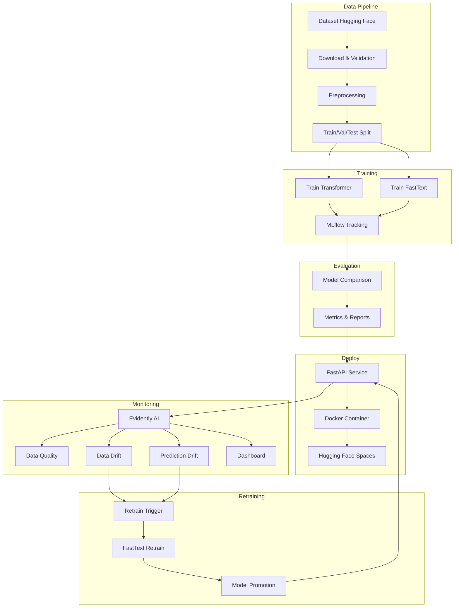

# Architettura Sistema Sentiment Analysis MLOps

## Overview

Il sistema implementa un'architettura end-to-end per sentiment analysis con best practices MLOps, includendo data pipeline, training modelli, deploy, monitoring e retraining automatico.

## Diagramma Architettura

## Componenti Principali

### 1. Data Pipeline

**Moduli**: `src/data/`

- **download_dataset.py**: Download automatico da Hugging Face con validazione
- **preprocessing.py**: Pulizia testi standardizzata (URL, menzioni, hashtag)
- **validation.py**: Controlli qualità dati (distribuzione classi, lunghezza testi)
- **split.py**: Split stratificato riproducibile train/val/test

**Caratteristiche**:
- Preprocessing identico per entrambi i modelli
- Tracciabilità con hash SHA256
- Validazione automatica qualità

### 2. Modelli

**Moduli**: `src/models/`

#### Transformer Model
- **Modello**: `cardiffnlp/twitter-roberta-base-sentiment-latest`
- **Caratteristiche**: Pre-addestrato su Twitter, supporta fine-tuning
- **Uso**: Modello principale ad alta accuratezza

#### FastText Model
- **Modello**: FastText supervised
- **Caratteristiche**: Leggero, veloce, baseline per confronto
- **Uso**: Retraining automatico, inferenza veloce

### 3. Training & Evaluation

**Moduli**: `src/training/`, `src/evaluation/`

- **MLflow**: Experiment tracking, model registry
- **Metriche**: Macro-F1 (principale), accuracy, precision, recall
- **Confronto**: Valutazione comparativa su stesso test set

### 4. API Service

**Modulo**: `src/api/`

- **Framework**: FastAPI
- **Endpoint**:
  - `/predict`: Inferenza con selezione modello
  - `/health`: Health check
  - `/models`: Lista modelli disponibili
  - `/feedback`: Raccolta feedback per monitoring

### 5. Monitoring

**Modulo**: `src/monitoring/`

- **Evidently AI**: Report automatici
  - Data Quality: Qualità dati input
  - Data Drift: Cambiamenti distribuzione dati
  - Prediction Drift: Cambiamenti distribuzione predizioni
  - Performance: Metriche produzione (se ground truth disponibile)

- **Dashboard**: Streamlit per visualizzazione centralizzata

### 6. Retraining

**Modulo**: `src/training/retrain_fasttext.py`

- **Trigger**:
  - Data drift rilevato
  - Performance degradata
  - Schedule temporale (mensile)

- **Criteri Promozione**:
  - Macro-F1 miglioramento >= 2%
  - Nessuna classe degradata > 5%
  - Validazione su holdout set

## Flusso Dati

1. **Ingestion**: Dataset scaricato da Hugging Face
2. **Preprocessing**: Pulizia e normalizzazione
3. **Validation**: Controlli qualità
4. **Split**: Divisione train/val/test
5. **Training**: Addestramento entrambi i modelli
6. **Evaluation**: Valutazione comparativa
7. **Deploy**: API containerizzata
8. **Monitoring**: Report continui Evidently AI
9. **Retraining**: Aggiornamento automatico quando necessario

## Scelte Tecnologiche

- **MLOps**: MLflow (tracking), Evidently AI (monitoring)
- **API**: FastAPI (performance, async support)
- **Container**: Docker (deploy consistente)
- **Deploy**: Hugging Face Spaces (demo pubblica)
- **CI/CD**: GitHub Actions (test automatici, gating metriche)
- **Testing**: pytest (unitari, integrazione)

## Scalabilità

- **API**: Supporta multiple istanze con load balancer
- **Modelli**: Caching in memoria per performance
- **Monitoring**: Batch processing per report periodici
- **Retraining**: Asincrono, non blocca inferenza

## Sicurezza

- **Input Validation**: Pydantic schemas
- **Error Handling**: Gestione errori robusta
- **Logging**: Log strutturati per audit
- **CORS**: Configurabile per produzione

## Estensioni Future

- Retraining Transformer automatico
- A/B testing modelli in produzione
- Multi-lingua support
- Real-time streaming inference
- Integrazione con piattaforme social media reali

